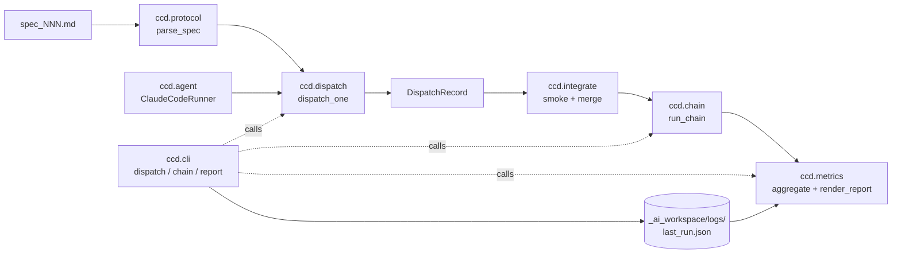

# Architecture

Cowork-CC-dispatch のモジュール構成と、1 spec が dispatch されてからレポートに反映されるまでの流れ。

設計の意図と原則は [`DESIGN.md`](DESIGN.md) を正典とする。本ドキュメントは「どのモジュールがどのモジュールを呼ぶか」を素早く俯瞰するためのもの。

## 全体の流れ



実線が「データの流れ」、点線が「CLI 層が内部関数を呼ぶ」関係。CLI は薄い玄関であり、ロジックは各モジュールに閉じている。

## モジュールの責務

| モジュール | 責務 | 主な公開 API |
|---|---|---|
| `ccd.models` | 共有データ型。型を 1 か所に集めることで他モジュールが互いを import せずに済む。 | `Spec` / `Result` / `DispatchRecord` / `DispatchStatus` / `FailureCategory` |
| `ccd.protocol` | `spec_NNN.md` / `result_NNN.md` の **read/write**。bridge プロトコルの単一源泉。 | `parse_spec` / `write_spec` / `parse_result` / `write_result` |
| `ccd.agent` | エージェント呼び出しの境界。`ClaudeCodeRunner` が本番、`FakeAgentRunner` がテスト用。 | `AgentRunner` (Protocol) / `ClaudeCodeRunner` / `FakeAgentRunner` |
| `ccd.dispatch` | 1 spec を一度だけ runner で実行し、結果（commit 数 + result file）から `DispatchRecord` を分類する。 | `dispatch_one` |
| `ccd.integrate` | smoke コマンド実行（既定: `ruff check .` + `pytest -q`）→ 成功時のみ feature branch を `main` に `--no-ff` merge。失敗時は merge せず `main` を汚さない。 | `integrate` / `DEFAULT_SMOKE_COMMANDS` |
| `ccd.chain` | 複数 spec を順に `dispatch_one` → `integrate` で回す。失敗で halt。各 spec ごとに `feat/<spec_id>` ブランチを切る。 | `run_chain` / `ChainResult` / `ChainStep` |
| `ccd.metrics` | 7 メトリクス（dispatch success / autonomous completion / safe halt / duration / first-pass / retry recovery / failure taxonomy）の集計と Markdown レンダリング。 | `aggregate` / `render_report` / `MetricsReport` |
| `ccd.cli` | `ccd dispatch` / `ccd chain` / `ccd report` の薄いラッパ。runner と smoke_commands はテスト用に注入可能。 | `main` / `build_parser` |

## 依存関係

下位モジュールほど依存が少ない。

```
cli ─► dispatch ─► agent ─► models
       chain    ─► integrate ─► models
                ─► dispatch
       metrics  ─► chain
                ─► models
       protocol ─► models
```

`models` は他のどのモジュールにも依存しない（共有ボキャブラリ）。`protocol` も `models` 以外に依存しない。`cli` がトップで、ユーザに見える唯一の境界。

## 1 spec の lifecycle

1. **parse**: `ccd dispatch spec_001.md` → `protocol.parse_spec` が `Spec` を返す。
2. **run**: `dispatch.dispatch_one` が `agent.AgentRunner.run` を 1 回呼ぶ。runner は `claude` CLI をサブプロセス起動。
3. **classify**: dispatch は `_ai_workspace/bridge/outbox/result_NNN.md` の有無・内容と、エージェントが行った commit 数を見て `DispatchRecord` の `status` / `failure_category` を確定。
4. **integrate** (chain 時のみ): `integrate.integrate` が smoke を走らせ、`status == DONE` かつ smoke green のときだけ feature branch を main に merge。
5. **persist**: CLI が `DispatchRecord` 群を `_ai_workspace/logs/last_run.json` に保存。
6. **report**: `ccd report` が JSON を読み戻して `metrics.aggregate` → `metrics.render_report` で Markdown 化。

## v1 のスコープ外（意図的）

- リトライ（`dispatch_one` は `attempts=1` 固定）。`first_pass_rate` と `retry_recovery_rate` は将来リトライ機構が入った時のために枠だけ用意。
- `git push` / GitHub 連携。`integrate` は `main` への local merge までで止め、push は人が判断する。
- 複数エージェント切り替え。`AgentRunner` Protocol はあるが v1 では `ClaudeCodeRunner` のみ実装。
